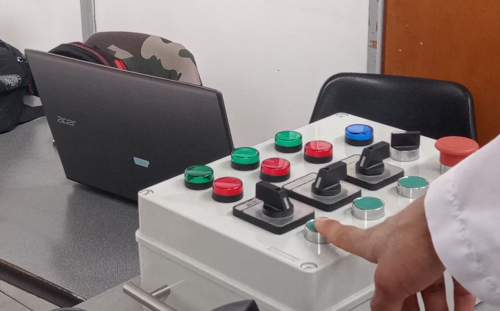
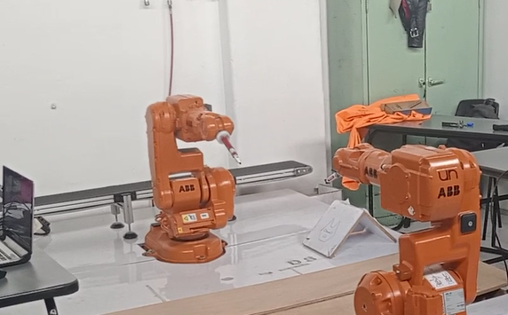

# Laboratorio 3 - Robótica Industrial 2, Entradas y Salidas
Desarrollado por Daniel Cruz y Cristhian Pulido

## Descripción de la solución planteada

https://user-images.githubusercontent.com/53317895/194460750-c61aa55e-3e25-4ca4-9f7e-ecc17207033b.mp4

### Entradas
Se utilizan dos entradas analogas dispuestan en el controlador del Robot  
<p align="center"></p>
### Salidas 


<p align="center"></p>


### Posición de Home 
<p align="center"></p>

### Ejecución de rutina 

### Posición de Mantenimiento 

## Explicación del código 

```mod
 PROC main()
        Path_inicial;
    	WaitTime 1;
        IF EntDI_1 = 1 THEN
            SetDO SalDO_1,1;
            Path_tdibujo;
            Path_dibujo;
            Path_tdibujo;
            Path_inicial;
        ELSEIF EntDI_2 = 1 THEN
            Path_changeTool;
            SetDO SalDO_1,0;
            WaitDI EntDI_2,1;
            Path_setTool;
        ELSE
            Path_inicial;
        ENDIF
    ENDPROC
```
## Conclusiones
