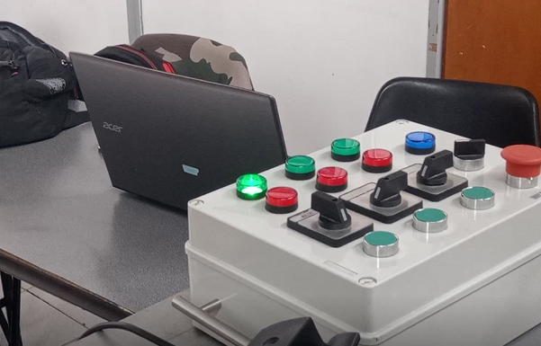
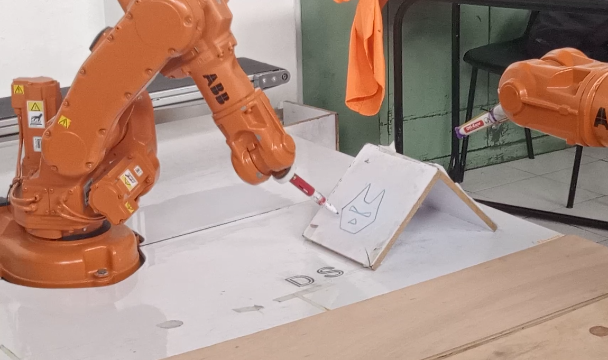
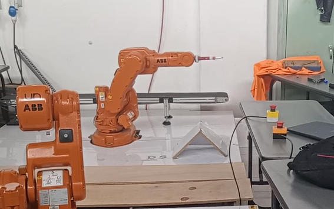

# Laboratorio 3 - Robótica Industrial 2, Entradas y Salidas
Desarrollado por Daniel Cruz y Cristhian Pulido

En este repositorio se encuentra el desarrollo del laboratorio 3 de robotica orientado al manejo de entradas y salidas para el robot ABB IBR 140. 
## Descripción de la solución planteada
En el siguiene video se presenta la solucion planteada, en donde se utlizan dos entradas digitales. En caso de que el robot inicie en una postura aleatoria lo primero que hace la rutina es llevarlo a la posicion de home y esperar alguna de las señales de entrada. Con la primera entrada el robot ejecuta la rutina de movimiento encarga de hacer el dibujo y una vez finalizado retorna a la posicion de home; como se ve en el video, al alaccionar esta entrada tambien se prende un led (salida digital). Con la segunda entrada el robot va hacia una posicion que facilite el cambio de la herramienta y apaga la luz encendida previamente, en este posicion el robot espera nuevamente l señal de entrada 2 para retornar a la posicion de home.

https://user-images.githubusercontent.com/53317895/194460750-c61aa55e-3e25-4ca4-9f7e-ecc17207033b.mp4

### Entradas
Como se menciono anteriormente se utilizan dos entradas digitales dispuestan en el controlador del Robot (IRC5). la primera hace la rutina de dibujo, enciende un led y vueleve a la posicion inicial y la segunda entrada se encarga de llevar el robot a la posicion de cambio de herramienta y retornarlo a la posicion de home.   
<p align="center"></p>

### Salidas 
Como salidas se tiene el led que se mantiene enciendido al accionar la primer entrada y se apaga con la segunda entrada.

<p align="center"></p>


### Posición de Home 

Esta poscion corresponde a la posición dada por el fabricante la cual tiene un offset en la articulacion 2. 
<p align="center"></p>

### Ejecución de rutina 
A continuacion se presenta un figura de la rutina de movimiento.
<p align="center"></p>

### Posición de Mantenimiento 
Para detallar la posicion de mantenimiento del robot se presenta la siguiente imagen. 
<p align="center"></p>

## Explicación del código 
En este seccion se presenta el codigo implementado en RAPID para realizar este laboratorio. Cabe resaltar que las entradas y salidas fueron ajustadas directamente en el flexpendant y se asignaron al modelo mostrado anteriormente. La rutina basicamente consta de un if/else el cual utiliza como expresion las señales de entrada, asi que las rutinas se ejecutan solo cuando estas sean accionadas.

```mod
 PROC main()
        Path_inicial;
    	WaitTime 1;
        IF EntDI_1 = 1 THEN
            SetDO SalDO_1,1;
            Path_tdibujo;
            Path_dibujo;
            Path_tdibujo;
            Path_inicial;
        ELSEIF EntDI_2 = 1 THEN
            Path_changeTool;
            SetDO SalDO_1,0;
            WaitDI EntDI_2,1;
            Path_setTool;
        ELSE
            Path_inicial;
        ENDIF
    ENDPROC
```
## Conclusiones
Gracias a este laboratorio se entiende la facilidad a nivel de programación en el manejo de entradas y salidas para un robot industrial, con lo cual se pueden generar rutinas programadas para procesos industriales que sean repetitivos. 
Asi mismo, este laboratorio nos sirvio para afianzar los conocimientos adquiirdos en el laboratorio 1, particularmente la definición de objetivos (targets), rutas (paths), alcanzabilidad y postura. 
